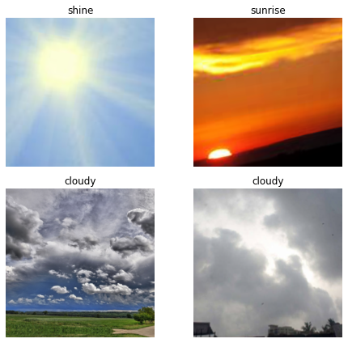

# How webcams can help farmers in developing countries

### Creating virtual weather stations via webcam image classification

The accuracy of numerical weather prediciton models (NWP) like the GFS (Global Forecast System) or the ECMWF's (European Centre for Medium-Range Weather Forecasts) NWP are heavily dependent on input validation data. Based on the input validation data, basically a snapshot of the current athmosphere's of the earth, those weather models try to anticipate future weather conditions by applying physical calculations. 

#### It is noticeable, that with rising accuracy and granularity of input validation data, the models output accuracy is rising too. 
That leads to the circumstance, that higher developed regions with more weatherstations have - as expected - better forecasts. In the following figure, the worldwide SYNOP (surface synoptic observations) weather station distribution is displayed. The gabs are obvious.

*SYNOP weather observations are made by both automated and manned weather stations every 6 hours. (That's because most of the numerical weather models are calculated 4-times daily, so they need input values every 6 hours)*

If you need higher temporal resolution, you need to use METAR weather observation reports, which are being created every 30 minutes in average. METAR reports are made by airports and are distributed via different organizations like NOAA, WMO or DWD. With a count of about 5433 stations, the gaps in certain regions are even bigger.

Normal weather stations are expensive, need to be monitored regularly and can get robbed when placed outside, so they are not really a solution for developing countries. Based on *'You have to work with what you have'* Google did not set up car counters to anticipate the current traffic situation in Google Maps, but used crowdsourced data that was already there. It just needed to be extracted. So, what is already there, is free to access and contains information about the environmental situation? **Right, webcams.**

### *Is it possible to source weather condition information out of already existing webcams, that are free to access?*

We have a [dataset](https://data.mendeley.com/datasets/4drtyfjtfy/1#:~:text=Multi%2Dclass%20weather%20dataset\(MWD,image%20using%20heterogeneous%20ensemble%20method%E2%80%9D.) with 4 different environmental conditions, that are:
1. shine (sunshine)
2. rain
3. clouds
4. sunrise

The whole datasets of weather images consits of **1054** single images. We will be using the common convolutional neural network (CNN) models RESNET34 and RESNET50. Those models are both pretrained with the [ImageNet](http://www.image-net.org/) dataset, that contains more than 14 million images. 

*This is a single batch from our dataset(unfortunately clouds are twice in this batch):*

### After training 5 epochs with RESNET34, we get 94.46% accuracy. 

| epoch | error_rate |
|-------|------------|
| 0     | 0.386667   |
| 1     | 0.151111   |
| 2     | 0.195556   |
| 3     | 0.102222   |
| 4     | 0.053333   |

### After training 4 epochs with RESNET50, we can even get 96.44% accuracy. 

| epoch | error_rate |
|-------|------------|
| 0     | 0.111111   |
| 1     | 0.053333   |
| 2     | 0.031111   |
| 3     | 0.035556   |

### Which conditions were most difficult to predict?

### Example predictions

## The answer is: Yes, it is possible to predict weather conditions, based on webcam images

For farmers the most important weather condition factors are precipitation and cloud coverage. **By using deep neural networks, we can classify those features using free-to-access webcam images.** The method we have shown can be used to validate weather factors like cloud coverage or rainfall with very high accuracy (96,44%). Common weather stations measure much more factors like temperature, rain amount, pressure etc., while webcams currently do not. That's why further research is needed. By using webcams as additional weather data sources, gaps in weather station coverage can be reduced. This can enhance numerical weather predictians especially in developing countries, what is indispensable for farmers there.

All the code used can be accessed via this repository with MIT License.

(c) 2020 Marvin Gabler